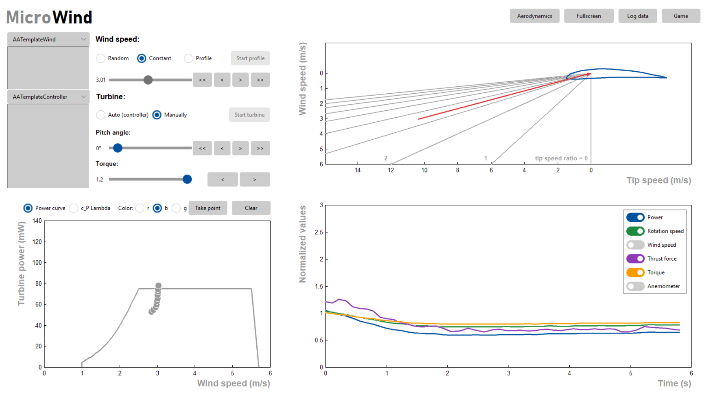
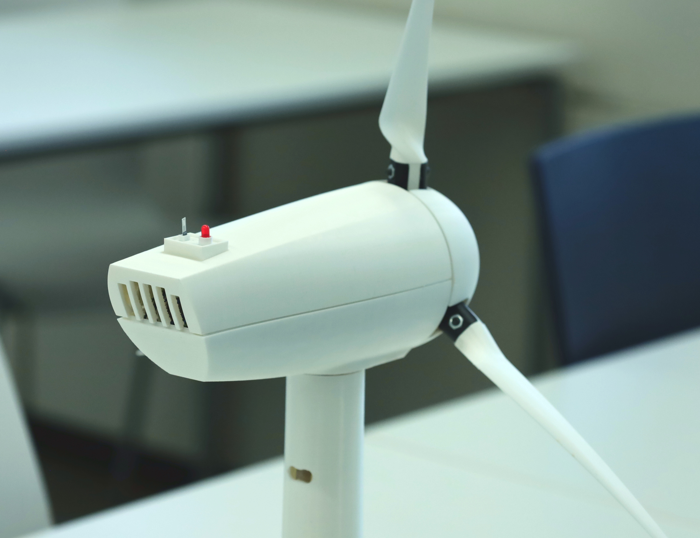

# MicroWind

*(c) Soeren Pinsdorf / LUH*

MicroWind is an easy to build, 3D-printed miniature wind turbine model 
equipped with various functionalities and sensors. 
The project also features a graphical interface for turbine and wind tunnel control 
and real-time measurement data plots. Its aim is an educational purpose: 
to convey the behavior of a wind turbine in different operation conditions.  
**It is not suited for electricity generation.**  
The repository contains the stl files for 3D printing, the source code for the arduino microcontroller, 
the source code for the graphical interface written in python and tkinter and the documentation.

## Features
* Wind turbine with rotor diameter of 320mm.
* Rated wind speed between 2.5 and 3 m/s.
* Variable blade pitch.
* Variable torque (with limitations).
* Rotation speed measurement.
* Power measurement.
* Thrust force measurement.
* Wind speed measurement with thermal anemometer.
* Bearing friction compensation.
* Compact and appealing wind tunnel design.
* Wind tunnel speeds up to 6 m/s.
* Easy to use user interface for control and measurement display.
* Python template script for easy programming pitch and torque controller (e.g. PID).
* Arcade style game where you have to set pitch in varying wind conditions

## Requirements
The software will be provided as source code to run in a Python interpreter. 
You will need a Python installation and some additional packages to run the software.
Check [requirements.txt](interface/requirements.txt) for the additional packages and 
the installation guideline in the [documentation.md](docs/documentation.md).

The gui works well on Windows systems and is designed and tested on Windows. 
It also works on linux systems with a few minor graphical issues which may be fixed in the future.
The additional package python3-tk is required on debian and python3-tkinter on fedora systems. 
For the arcade game to work properly, a 1920x1200 screen is required. 
For now, the arcade game graphics are not scalable. 

## Required skills
The project is designed for an easy build. However, depending on where and when you are building the turbine, 
some parts may not be available and some alterations must be made. 
Therefore, the project requires some skills:
* Soldering, and basic understanding of electronic circuit design.
* Precise 3D-printing. FDM is fine, but you will need a nozzle size of 0.25 for some parts.
* Postprocessing 3D-printed parts, drilling, inserting threaded inserts.
* Arduino programming, if one of the sensors has to be replaced with a different brand.
* Python programing if you want to tailor the GUI to your needs.
* General troubleshooting ability and patience. 
Even a good documentation is never perfect.  
And this one is not a step by step manual (yet). You may need to dig a little to get it working.  

If you find yourself comfortable tackling the aforementioned requirements then we wish you a **happy build!** 
If you run into trouble don't hesitate to ask.

## Contribution
We decided to publish the project on GitHub, so it is easy for you to contribute. 
Whether you are a software developer willing to improve the code, 
or you stumbled across some shortcomings in the documentation while building, 
we kindly ask you to contribute your upgrades to the project. 
The project is mostly created by mechanical / wind energy engineers, who are not professionals in all fields. 
We believe that there are still many improvements to make. See [contribution.md](contribution.md) for open issues.

## Acknowledgements
The initial MicroWind project was funded for the improvement of study
conditions by the Leibniz University Hannover.

## License
The software is licensed under GPLv3.  
The 3D-parts for printing and the documentation is licensed under CC-BY 4.0.
See [LICENSE.md](LICENSE.md) for more information about GPLv3 and CC-BY 4.0.  

The theme for the GUI is licensed under the MIT license
See [LICENSE-Third-Party.md](LICENSE-Third-Party.md) for more information

## Impressions

*(c) Soeren Pinsdorf / LUH*

