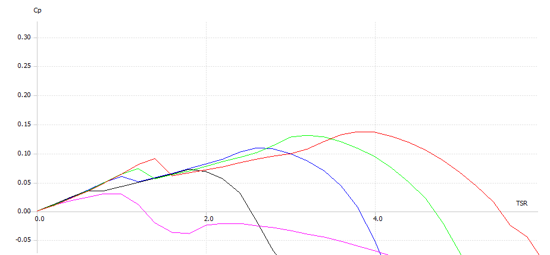
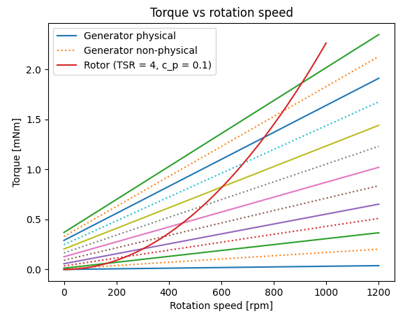
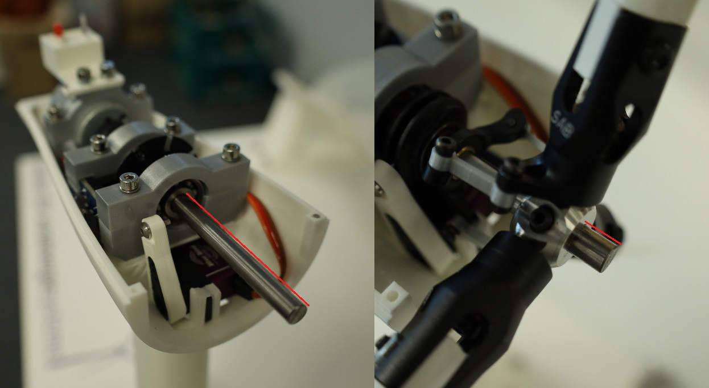

# Documentation

## Challenges of MicroWind
Let's first talk about the difficulties of designing this wind turbine and the wind tunnel. 
This will help to understand the one or the other important steps in the build process.

### Rotor design
First, the turbine operates at is very low wind speeds.
The aim was to design a wind tunnel, 
that is portable between different locations, lecture rooms, exhibitions. 
To achieve this small size, an open wind tunnel was the only possible solution.
An open wind tunnel moves a lot of air and makes noise, which you don't want in public. 
So the design is a compromise of keeping wind speeds as low as possible, 
while allowing the turbine to operate in all modes (idle, partial load, full load, cut-out) 
and clearly distinct between them. 
Wind speeds below 3 m/s are quite difficult to measure precisely without very expensive equipment.
This means calibration of the absolute wind speed is maybe a bit off, 
which affects power coefficient and other values.
But it is actually not as bad as it sounds. 
The main idea behind this project is to show wind turbine operation and not to prove the aerodynamic design.
And this is done by comparing relative values, by the change in rotation speed, 
by the change in power related to different pitch angles. 
And this works great!

Because of the relatively small wind speed and the turbine size, 
we operate in very, very low Reynolds numbers (1000 to 4000).
So don't expect the same aerodynamic performance you would get from a real-sized turbine.
The rotor blades are designed with QBlade and tailored for small Reynolds numbers. 
The tailoring results in very thin and high camber airfoil shapes, 
completely different to the shapes large turbines use. 
We used NACA 9702 at the blade root and NACA 9707 at the blade tip with a constant thickness of the blade, 
which is the minimum required thickness for printing.
A sharp leading edge is quite important to increase performance in these operating conditions.
Thus, a fine nozzle is required for printing the blades.
The rotor design for QBlade v0.963 is provided in the docs folder. 
Figure 1 shows the rotor performance by design. 
With our turbine and wind tunnel, we found a maximum power coefficient of around 0.1 instead of the proposed 0.14. 
This can have multiple reasons. 
Because of the cubic relationship between power and wind speed, 
small errors in wind speed result in large errors in power and power coefficient. 
The wind field in the tunnel is far away from perfect and not adequately filtered. 
Turbulence from the fan and a radially varying wind speed result also has an influence of the aerodynamic performance.
And finally, the assumptions made in the design process of the blades may not correct or precise for such small rotor geometries.
Therefore, we are actually quite happy with the result of the rotor performance given these circumstances. 
However, if you have a very well calibrated wind tunnel with perfect air flow you may encounter better values.

  
_Figure 1: Rotor performance calculated in QBlade for pitch angles of 
0° (red), 5° (green), 10° (blue), 20° (black) and 40° (pink)._

### Wind tunnel design
For the wind tunnel itself, the capability to filter the air flow is limited, 
due to the short design.
It is most important to remove the tangential induction from the fan, 
as this would result in a rotation of the air inside the tube. 
Also, the stream velocity from the fan increases with the radius. 
The filter design tries to compensate this a little 
and increase the velocity in the center of the wind tunnel. 
No doubt, this is not a perfect filtering, but it works surprisingly good.
Feel free to improve it, if you like.

A second problem resulting from the wind tunnel design 
is the short distance between the rotor blade tip and the wall of the wind tunnel. 
To ensure a free stream around the turbine, just like the stream around a real turbine,
we would need to increase the diameter of the tunnel to a size, where you won't get it through a door.  
If the wind tunnel walls are too close, static pressure builds up in the tunnel in front of the turbine,
because the turbine blocks the air flow.
Something that would increase the performance of our little turbine drastically, 
but is not physically correct if we want our turbine to behave like a real one. 
So we must prevent static pressure building up by opening the wind tunnel walls in front of the turbine. 
In our design, this is done by using two different sized tubes: 
a smaller diameter for the fan and a larger diameter for the "test section" where the turbine is located. 
The tubes overlap a little but air can get in and out freely. 
And it does! 
If the turbine is idling and not blocking the stream, 
air gets sucked in the gap between the two tubes by the main air stream. 
As soon as the turbine spins fast and blocks the stream, air gets blown out the gap.
Feel free to experiment with wind tunnel design yourself. 
Depending on your specific needs and what you want to do with the turbine, 
you may come up with a better solution.
If you don't need an outer tube at all, even better for the air stream!

### Generator torque control
Another drawback, which comes from the overall small design, is low torque. 
Physics does not mean it well with small turbines.
Rotor torque increases by the power of two with wind speed 
and by the power of three with rotor radius. 
In addition, the turbine is designed to run at high tip speed ratio, just like real turbines do.
This reduces torque by design in favor of rotation speed for increased aerodynamic efficiency. 
The torque is actually so low, that the remaining friction in the drivetrain has a huge impact.
While real wind turbines have a high mechanical efficiency in the drivetrain 
and low frictional losses in the bearings and the gearbox 
our little turbine has high losses. 
Even though we try to minimize friction by using unsealed and de-greased bearings, 
the electric efficiency may even be below zero, depending on the operation point. 
This is where friction compensation comes into play. 
Depending on the operation point, the generator either works as a motor or generator. 
A small voltage is applied to the generator which creates a moment to compensate the friction.
The frictional loss is then added to the electrical power of the generator, 
which itself can be positive (generator) or negative (motor). 
Thus, **the output we present is not the pure electrical power of the turbine**, 
but the aerodynamic power or drivetrain power. 
Depending on your bearings or your generator,
frictional torque may vary between each build of the turbine. 
So we use a potentiometer to control the necessary current flow for the compensation, 
which can be set individually for each build. 
Measuring this current enables us to determine the frictional torque 
with help of the generator torque constant.

Speaking of the generator torque constant: 
This is a very important parameter not only for determining the frictional loss, 
but the overall electrical power.
At the same time it is not provided by the manufacturer, 
so we tried our best to measure it with a miniature motor-generator test stand. 
It is maybe not very precise, but it as stated in the beginning, 
the main goal of the turbine is to show relative values and not absolute.

Our generator has a linear relationship with just an ohmic load resistor.
However, wind turbines require a quadratic torque vs rotation speed curve, 
to operate efficiently in partial load. 
To be able to model different torque curves, we can switch between different load resistors.
There are six switches with load resistors from 0 ohm to 33 ohm. 
Only one switch is on at a time setting the torque level.
Closing all switches results in a seventh torque level, 
which is ideally torque free for all rotation speeds.

To enable a finer stepping than just seven torque curves, 
we use six additional non-physical torque levels in between by toggling between two physical levels.
The resulting generator curves are shown in Figure 2. 

_Figure 2: Torque vs rotation speed curves for different load switch states. 
The dashed lines are non-physical states by toggling between the upper and lower physical states._

## 3D-Printing Parts
Printing the parts is straight forward. 
The parts are designed to require only a minimum of support structure while printing. 
This way it should be possible to print everything with a single nozzle printer.
It is recommended to use a fine nozzle size (0.25mm) 
for the nacelle's parts to get a nice appearance and a good fit. 
The rotor blades are required to be very thin for optimal aerodynamic performance. 
A 0.25mm nozzle and a high print quality is required here.
The safety grid at the wind tunnel's exit also requires thin walls. 
Otherwise, a fair amount of wind speed is blocked. 
Consider to exclude it if not needed in your application. 
There is not a high potential of danger from the spinning turbine, 
but grabbing inside the tunnel and touching the turbine could lead to damage.  
The large parts of the wind tunnel assembly can be printed with a 0.8mm nozzle. 
One of the challenges you may face is getting the tolerances of the 3D-printed assemblies inside the wind tunnel 
and the tubes for the tunnel right. 
Maybe these parts need a lot of refinishing. 

## Wiring the Sensors
Follow the schematic in [circuit.svg](circuit.svg) to solder the sensors and the additional electronic parts. 
Consider using a large veroboard and place the arduino in the middle. No SMD soldering required.
You are free to choose what kind of cable you use between the turbine and the micro controler. 
This depends on the distance between these two and if it has to be plugable or not. A 15-Pin D-Sub cable could do the job. 

**Be careful:** The resistance of the wires between the generator and the load resistor switch circuit will add up to the generator load.
An increase in the load will decrease the torque vs speed curves of the turbine. 
Possibly, the generator is not able to produce enough torque to reach rated power at rated wind speed. 
Follow the instructions in the schematic to measure the total resitance. 
If your measured resistance is lower, consider adding a resistor to compensate. 
If your resistance is too high, reduce cable length or choose a different cable.

## Assembly
*Ideally, here should follow a lot of images from the build process. Sadly, when we build the first and so far only turbine, 
we didn't consider publishing the project as open source and didn't take any image. 
If you are the first one to build by this instruction, please ask us when in doubt. 
And we would highly appreciate, if you could take some pictures of the build process and share it.*

A few notes:
* Carefully replace the bearings in the pitch slider with cleaned and unsealed ones to reduce friction. 
Probably it is held together with Locktite and difficult to unscrew, but worth the process. 
When putting back together don't tighten too much. The bearings should spin freely.
* Use a tiny bit of Locktite for all the small screws in the pitch assembly, or it will fall apart eventually. 
* You maybe want to run the software with all sensors wired so and set the pitch angle to 40 degrees. 
Then, put the pitch lever on the servo and assemble the rest. This way you already have a rough servo calibration, 
which will speed up the calibration process later.
* The load cell gets damaged really quick, so be careful. Don't apply high loads or torque at the nacelle after the load cell is mounted.
* Place the fan exactly at the center of the tube. Make sure that there is an equal distance between fan blade tips and the wall.

There is one thing quite crucial about the assembly of the nacelle, 
which is the position of the hub relative to the first main bearing. 
We use the main bearing as an end stop to calibrate the pitch angle to 85°, 
thus, a wrong distance will result in a error in pitch angle calibration.
Moreover, if the distance is too large the pitch mechanism can get stuck.
Luckily, the other end stop of the pitch slider is the hub itself. 
So at least for the calibration of the 0° position, 
we are good as long as the printed pitch bones have the correct length. 

The space between the main bearing and the back side of the hub should be 35 mm.
Because this distance is difficult to measure during assembly, we recommend mounting the main shaft with
a distance between the main bearing and the tip of the main shaft of 53.5 mm.
Then the distance between the front side of the hub and the tip of the main shaft should be 7.5mm. 
The assembly is shown in Figure 3.

_Figure 3: Distances to measure during assembly. Bearing to tip: 53.5 mm. Hub to tip 7.5mm._

## Installation and Running the Interface
1. Flash the [arduino code](../arduino/arduino.ino) to the Arduino Mega using the Arduino IDE.
2. Install the latest Python version on your computer
3. Install the required python packages listed in [requirements.txt](../interface/requirements.txt) using pip installer   

    py -m pip intall requirements.txt

4. Execute the [main.py](../interface/main.py) within Python to start the graphical user interface
    

    py interface/main.py  

## Command line interface
If you want to control the turbine via command line instead of using the GUI 
you can do so by importing and initializing the Driver class from [driver.py](../interface/driver.py)
Here you can manipulate all the variables and turbine parameters yourself, 
but you have to send and receive the data to and from the arduino manually. 
Here is an example to change the pitch angle to 10 degrees and reading the rotation speed using the command line.

    from interface.modules.driver import Driver
    # Initialize class to control turbine
    turbine = Driver()  
    # retrieve data first
    turbine.read_from_arduino()  
    # change pitch angle variable to 10 degrees
    turbine.beta_set = 10  
    # send data
    turbine.write_to_arduino()  
    # retrieve data
    turbine.read_from_arduino()
    # print rotation speed
    print(turbine.rot_turb)

There is also a command to print all parameters at once.  

    turbine.print_values()

**Warning: There won't be any over speed protection when using the command line interface. 
Speeds above 1200 rpm may damage the turbine, so use this tool with caution.**

## Calibration
### 1. Friction Compensation
As stated in the [challenges section](#Challenges-of-MicroWind), 
we compensate the friction of the drivetrain by applying a small voltage to the generator.
To calibrate the amount of compensation use the 200 ohm potentiometer shown in the [circuit.svg](circuit.svg).
Do so while the power supply is on and the arduino is connected via USB. 
But do not start the interface. This ensures that all load resistors are switched off. 
Set the potentiometer so that the turbine does not start spinning on its own. 
Give the rotor a little push, the rotor should continue to spin at very, very low speed and not stop.

### 2. Pitch Angle Calibration
To calibrate the pitch angle it is best to remove the upper cover of the nacelle and the spinner.
Run the calibration script [calibrate_pitch.py](../interface/calibrate_pitch.py) 

    py interface/calibrate_pitch.py

and incrementally add or remove servo time until the pitch slider touches the physical limits.
If assembled correctly, this will result in a pitch range of -5° to 85°.

### 3. Thrust Force Calibration 
To calibrate the thrust force, you will need some kind of spring force gauge or be creative.
Run the calibration script [calibrate_thrust.py](../interface/calibrate_thrust.py) 

    py interface/calibrate_thrust.py

and follow the instructions.

### 3. Wind Tunnel Calibration
Next the wind speed of the tunnel will be calibrated. 
We do this by the assumption that the turbine is spinning with a tip speed ratio of 2.5 at a pitch angle of 20 degrees.
Run the calibration script [calibrate_wind.py](../interface/calibrate_wind.py) 

    py interface/calibrate_wind.py

and follow the instructions.

### 4. Torque Calibration
Once the pitch and wind speed is calibrated, 
we can run the torque calibration [calibrate_wind.py](../interface/calibrate_wind.py):

    py interface/calibrate_torque.py

### 5. Thermal Anemometer Calibration
Now that the wind speeds are calibrated, we can calibrate the thermal anemometer.
Run the calibration script [calibrate_anemometer.py](../interface/calibrate_anemometer.py) :

    py interface/calibrate_anemometer.py

Maybe the range of the anemometer is not set right 
and the output is saturated either at the lower or the upper end.
In this case try to tune the amplification of the anemometer with the potentiometer and try again.

